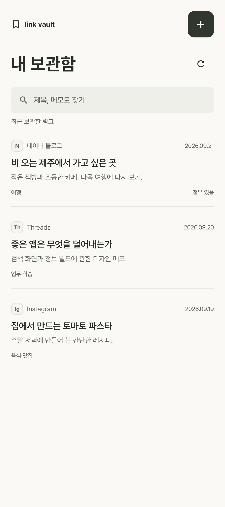
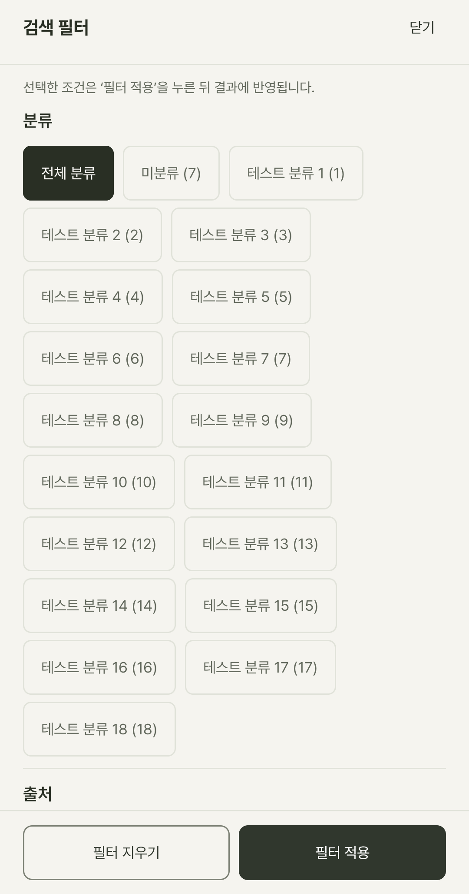
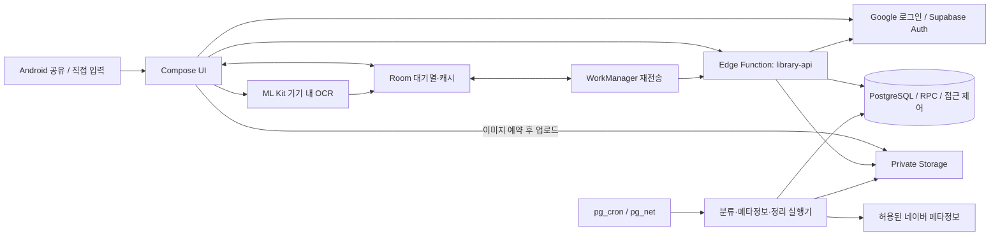

# Link Vault

**여러 앱에 흩어진 관심 링크를 한곳에 보관하고, 다시 찾아 원문으로 돌아가는 Android 앱입니다.**

공유 메뉴나 URL 붙여넣기로 링크를 저장하고, 제목·메모·분류를 단서로 다시 찾습니다.
사용자가 선택한 이미지 1장을 첨부하고, 기기 내 OCR로 읽은 텍스트도 검색 단서로 활용합니다.

> **개발 상태:** 주요 기능의 로컬 구현·검증을 마쳤습니다. 실제 Google 로그인과
> 별도 테스트 회원의 재인증 기반 탈퇴도 로컬에서 확인했습니다.
> 실제 사용자 품질 평가와 운영 배포 인수는 미완료이며, 공개 출시·외부 베타 준비 완료를 뜻하지 않습니다.
> 이 상태는 기존 개발 기록의 요약이며 README 개편 때 기능 시험을 다시 실행한 결과는 아닙니다.

[주요 기능](#주요-기능) · [제공 범위](#제공-범위와-제한) · [아키텍처](#시스템-아키텍처) · [로컬 실행](#로컬-실행) · [검증](#테스트와-검증-범위) · [상세 문서](#상세-문서)

## 화면과 사용 흐름

| 내 보관함 | 검색 필터 |
| --- | --- |
|  |  |
| 제목·출처·메모를 읽고 저장한 링크를 다시 찾습니다. | 조건을 고른 뒤 필터 적용으로 결과에 반영합니다. |

위 이미지는 기존 QA에서 **합성 자료로 실제 Compose 컴포넌트를 렌더링한 화면**입니다.
실제 회원 자료나 SNS 앱 연동 성공의 증거가 아닙니다.

```text
공유 메뉴 / URL 붙여넣기
        → 링크 확인·선택 → 메모와 함께 저장
        → 내 보관함 → 검색·분류로 다시 찾기 → 원문 앱 또는 브라우저 열기
```

연결이 끊기면 전송 대기 상태를 확인하고, 재연결 후 서버 저장 결과를 확인합니다.
이미지는 저장된 항목과 첨부할 사진을 각각 명시적으로 선택합니다.

## 해결하려는 문제

관심 있는 글·장소·제품을 여러 앱에 저장하다 보면 **어디에 저장했는지부터 잊기 쉽습니다.**
Link Vault는 원문을 복제하는 대신 링크와 기억할 단서를 모읍니다.

- **한곳에 보관:** 출처가 달라도 링크를 같은 개인 보관함에 저장합니다.
- **기억으로 다시 찾기:** 제목·메모·확보한 메타정보·OCR 텍스트를 검색과 분류에 활용합니다.
- **원문으로 돌아가기:** 찾은 항목에서 원래 게시물을 엽니다. 원문 사이트의 로그인 요구나 삭제는 별개입니다.

## 주요 기능

| 기능 | 할 수 있는 일 |
| --- | --- |
| 링크 저장 | Android 공유 메뉴·직접 입력, 여러 HTTP/HTTPS 링크 중 하나 선택 |
| 개인 보관함 | Google 로그인과 회원 승인 후 서버 보관함 사용, 제목·메모 편집 |
| 검색 | 키워드·정해진 별칭 검색, 출처·기간·분류·미분류 필터 |
| 분류 | 규칙 기반 자동 분류, 사용자 분류 생성·수정, 직접 선택과 자동 분류 재적용 |
| 이미지·OCR | 항목당 이미지 1장 첨부·교체·삭제, 기기 내 한국어·라틴 문자 인식 |
| 오프라인 대응 | 저장·편집 등의 대기열, 마지막 서버 목록·상세 캐시와 동기화 시각 표시 |
| 데이터 관리 | 서버 항목 삭제, Google 재인증 기반 계정 탈퇴 |

일반 실행은 `내 보관함`에서 시작하며, 하단의 보관함·검색·설정과 별도 `링크 저장` 버튼으로 이동합니다.
라이트·다크 테마와 앱에 포함된 Pretendard를 사용합니다.

## 제공 범위와 제한

| 구분 | 현재 범위 |
| --- | --- |
| 플랫폼 | Android 8.0 이상(minSdk 26). iOS·PC 웹은 현재 제공하지 않음 |
| 회원 | Google 로그인 후 관리자 승인 필요. 승인 회원 최대 6명인 초기 베타 설정 |
| 보관 한도 | 회원별 항목 100개, 새 항목 분당 10건. 사용자 분류 30개, 항목당 분류 연결 5개 |
| 자동 정보 확보 | 허용된 네이버 호스트의 제한된 공개 메타정보만 수집 |
| 검색·자동 분류 | 키워드·승인된 별칭·규칙 기반. 자연어 이해나 생성형 AI 분석이 아님 |
| 오프라인 | 대기열·캐시 지원. 오프라인 검색을 서버 검색 완료로 대체하지 않음 |
| 이미지 | 직접 선택한 이미지 1장. 회원별 서버 이미지 총량 20,000,000바이트 |
| 미지원 | SNS 계정의 좋아요·저장 자동 수집, 전체 본문·영상 분석, 다중 이미지 첨부, 휴지통·삭제 취소, 사용자 export |

OCR은 기기에서 실행하지만 **첨부를 선택한 이미지와 인식 결과는 서버에 전송**됩니다.
서버 저장 완료와 기기 전송 대기, 이미지 저장 성공과 OCR 성공은 구분합니다.
삭제·탈퇴는 되돌릴 수 없으며, 백업을 포함한 모든 사본의 즉시 삭제를 보증하지 않습니다.
개인정보 안내는 [개발용 초안](docs/development-record.md#개인정보삭제-안내-초안)이며 확정 처리방침이 아닙니다.

## 시스템 아키텍처



회원 인증·승인·소유권을 확인한 API와 SQL 계약으로 데이터를 보호합니다.
일반 클라이언트가 테이블에 직접 쓰지 않으며, 백그라운드 작업은 임대·재시도·버전을 확인해 반영합니다.
위 그림은 구현 구성이고 운영 배포 완료를 나타내지 않습니다.

### 기술 스택

| 영역 | 기술과 역할 |
| --- | --- |
| Android UI | Kotlin 2.1.0, Jetpack Compose, Material 3 |
| 기기 저장·재시도 | Room 2.7.2, WorkManager 2.9.1 |
| 인증·통신 | Credential Manager, Google Identity, Supabase Auth, Ktor |
| 이미지 인식 | 번들된 ML Kit 한국어·라틴 OCR |
| 서버 | Supabase Edge Functions, TypeScript / Deno |
| 데이터·작업 | PostgreSQL, RPC·RLS, pg_cron·pg_net, 비공개 Storage |
| 검증 | JVM·Compose 계측 시험, pgTAP, Deno·Node 테스트, 로컬 통합 시험 |

## 핵심 기술적 의사결정

### 1. 연결이 끊겨도 요청의 의미를 바꾸지 않기

저장·편집 요청을 Room에 먼저 기록하고 WorkManager가 **같은 회원·요청 ID·본문**으로 재전송합니다.
응답 유실과 중복 전송 때문에 새 항목이 반복 생성되거나 기존 메모가 덮어써지는 것을 막습니다.
자동 전송은 생성 후 24시간까지이며, 만료 후에는 사용자의 재확인이 필요합니다.

### 2. 오래된 편집과 응답으로 최신 자료를 덮어쓰지 않기

편집은 `expected_version`으로 보호하고, 충돌하면 최신 내용을 확인한 뒤 새 요청으로 저장합니다.
늦게 도착한 낮은 버전의 응답은 최신 캐시를 덮어쓰지 않습니다.
로그아웃·계정 변경 시 기기 자료를 정리하고, 회원과 세션 경계로 대기 작업을 격리합니다.

### 3. 실제로 확보한 정보만 검색 단서로 사용하기

메타정보는 허용 호스트·공인 IP·TLS·시간·크기 제한을 적용해 읽습니다.
전체 본문이나 원격 이미지를 수집했다고 표시하지 않으며, OCR 실패를 이미지 저장 실패와 혼동하지 않습니다.
자동 분류보다 사용자의 직접 선택을 우선하고, 검색·분류의 일치 근거를 확인할 수 있게 합니다.

### 4. 삭제한 자료가 복원으로 되살아나지 않게 하기

항목 삭제는 원문·메모·검색 파생값·OCR을 지우고 후속 파일 정리를 진행합니다.
계정 탈퇴는 Google 재인증을 거쳐 접근을 차단한 후 파일·업무 데이터·Auth 계정을 정리합니다.
암호화 백업의 격리 복원에서는 삭제 기록을 적용하고 DB·파일·사용량을 검증합니다.
백업의 DB 덤프와 이미지 목록은 같은 읽기 전용 PostgreSQL 스냅샷을 사용합니다.
삭제 기록에 대응하는 행이 이미 없어도 삭제 묘비와 잔존 자료를 검사하며,
잠금 대기·덤프 실행 제한을 초과하면 불완전한 백업을 성공으로 게시하지 않습니다.
로컬 리허설 성공은 운영 백업·외부 키 보관·물리 폐기 검증을 대신하지 않습니다.

처리 경계는 [API 구현](supabase/functions/library-api/handler.ts),
[DB 마이그레이션](supabase/migrations)과 [상세 개발 기록](docs/development-record.md)에서 확인할 수 있습니다.

## 로컬 실행

명령은 **저장소 루트의 Windows PowerShell** 기준입니다.
Linux/macOS에서는 `.\android\gradlew.bat` 대신 `./android/gradlew`를 사용하고 환경변수는 해당 셸 문법으로 설정합니다.

### 1. 개발 환경 준비

- Android Studio에서 `android/` 열기
- JDK 17, Android SDK Platform 35, Gradle 8.10.2 Wrapper / AGP 8.7.3
- `ANDROID_HOME` 또는 `android/local.properties`의 `sdk.dir`에 SDK 경로 설정
- 서버 실행: Node.js 24와 실행 중인 Docker Desktop
- Google 로그인 확인: Google Play 지원 에뮬레이터 또는 호환 기기와 실제 Google 계정

### 2. Google OAuth와 서버 설정

Google Cloud에서 웹 OAuth 클라이언트와 Android 클라이언트를 등록합니다.
Android 패키지는 `com.linkvault.app`이며 debug/release 서명은 각각 등록해야 합니다.

```powershell
.\android\gradlew.bat -p android :app:signingReport
npm ci
```

현재 `supabase/config.toml`의 Google provider는 활성화되어 있습니다.
서버용 `GOOGLE_WEB_CLIENT_ID`와 `GOOGLE_CLIENT_SECRET`을 gitignored 루트 `.env`에 설정하고,
Edge의 audience 설정은 `supabase/functions/.env`에 보관합니다.
실제 키·토큰·client secret은 출력하거나 커밋하지 않습니다. nonce 검증도 끄지 않습니다.

```powershell
npm run backend:start
npm run backend:migrate
npm run backend:configure-worker
```

위 명령은 로컬 Supabase를 시작하고 마이그레이션과 작업 실행기를 설정합니다.
`backend:start`는 Edge `/v1/health`의 DB 준비 상태까지 확인합니다.
기존 DB를 초기화하거나 적용된 마이그레이션 이력을 수정하지 마세요.

### 3. 앱 연결 설정과 빌드

앱은 환경변수 또는 Gradle 프로젝트 속성에서 다음 값을 읽습니다.
**Gradle은 루트 `.env`를 자동으로 읽지 않습니다.**

| 설정 | 값 |
| --- | --- |
| `SUPABASE_URL` | 로컬 에뮬레이터: `http://10.0.2.2:18021` |
| `SUPABASE_PUBLISHABLE_KEY` | 해당 로컬 프로젝트의 publishable/anon 키 |
| `GOOGLE_WEB_CLIENT_ID` | 서버와 같은 웹 OAuth client ID |

호스트에서의 API 주소는 `http://127.0.0.1:18021`입니다.
실기기 연결에는 별도 네트워크 구성이 필요하며, 에뮬레이터 주소를 그대로 사용하지 않습니다.
HTTP 예외는 debug의 로컬 에뮬레이터용이고 일반 배포 앱은 HTTPS만 허용합니다.
앱에 service_role·`sb_secret_`·Google client secret을 넣지 마세요.

```powershell
.\android\gradlew.bat -p android :app:assembleDebug
```

APK는 `android/app/build/outputs/apk/debug/app-debug.apk`에 생성됩니다.
기기에 설치한 뒤 Google 로그인하고, 서버 관리자가 해당 회원 UUID를 `beta_members`에 승인하고
`approved_at`을 기록해야 보관함을 사용할 수 있습니다. 승인 대기는 오류가 아닙니다.

설정 없이도 APK는 빌드되지만 실제 로그인·서버 보관함은 사용할 수 없습니다.
가짜 로그인이나 로컬 전용 보관함으로 대체하지 않습니다.
[인증 설정 상세](docs/development-record.md#실제-google-로그인-설정)를 참고하세요.

## 테스트와 검증 범위

### 개발 검증 명령

```powershell
.\android\gradlew.bat -p android :app:testDebugUnitTest :app:lintDebug :app:assembleDebug
npm run test:api
npm run test:beta
npm run test:operations
npm run test:backend-start
```

에뮬레이터·기기 계측 시험과 로컬 DB 시험은 별도입니다.
**개인 자료 없는 전용 시험 기기·DB에서만 실행하세요.**

```powershell
.\android\gradlew.bat -p android :app:connectedDebugAndroidTest
npm run test:db
```

서버 연동 시험은 회원·항목을 만들고 정리하며, 일부 시험은 네트워크 차단·앱 강제 종료를 수행합니다.
실제 회원 자료가 있는 로컬 DB를 시험을 위해 비우지 마세요.
[통합 시험 순서와 안전 조건](docs/development-record.md#m1m4-로컬-서버와-검증)을 먼저 확인하세요.

### 실제 인수 기록용 CSV

새 checkout에서 `npm ci`를 실행한 뒤, 아래 명령으로 **빈 양식 두 개**를 생성합니다.
출력 디렉터리는 미리 만든 저장소 밖의 전용 폴더여야 하며, 기존 파일은 덮어쓰지 않습니다.

```powershell
$evidence = Join-Path $HOME ("link-vault-evidence-" + [guid]::NewGuid().ToString("N"))
New-Item -ItemType Directory -Path $evidence | Out-Null
npm run beta:templates -- --output-dir "$evidence"
```

- `device_capture_template.csv`: 실제 공유·저장 기록. Threads 8건, Instagram 8건,
  네이버 블로그 8건, 기타 공개 웹 6건을 기록합니다.
- `retrieval_tasks_template.csv`: 실제 기억 단서로 다시 찾는 과제 10개를 기록합니다.
- 헤더는 검사기의 `CAPTURE_HEADERS`·`RETRIEVAL_TASK_HEADERS`에서 생성합니다.
  URL·메모·검색어·계정 정보를 포함한 실제 기록은 계속 저장소 밖에 두고 커밋하지 마세요.

작성 후 같은 PowerShell 창에서 검사합니다.

```powershell
npm run beta:check -- --captures "$evidence/device_capture_template.csv" --tasks "$evidence/retrieval_tasks_template.csv"
```

헤더만 있는 빈 양식은 인수 자료가 아니므로 검사 **종료 코드 1이 정상**입니다.
생성 명령의 성공은 양식 생성만 뜻합니다. 작성된 CSV의 검사 통과도 실제 사용자 증거의
진위를 검증하거나 외부 베타·Google 인증 전체를 승인하는 결과가 아닙니다.
실행 날짜·기기/환경·앱 버전·`git rev-parse HEAD`·명령·결과·미실행 범위는
같은 외부 폴더에 기록하세요. 실제 Google 최초 로그인·재시작 복원·별도 빈 회원 탈퇴의
로컬 확인 기록과, 토큰 만료 갱신·자료가 있는 회원 탈퇴·운영 인증 인수는 구분합니다.

## 배포 자동화

- PR에서는 [CI](.github/workflows/ci.yml)와 [DB 계약 시험](.github/workflows/database-ci.yml)을 실행합니다.
  병합 순서는 **feature 브랜치 → develop → 검증 → main**입니다.
  `develop` push는 통합 검증만 수행하고, `main` push는 검증 후
  `production` Environment의 담당자 승인을 기다립니다. 운영 배포와 서명 릴리스는 `main`만 허용합니다.
- [서버 배포](.github/workflows/deploy.yml)는 별도 SSH 키와 강제 명령 계정만 사용합니다.
  API·마이그레이션만 전달하며, 서버의 Compose·비밀값·배포 수신기는 자동으로 덮어쓰지 않습니다.
  적용된 마이그레이션 변경은 거부하고, 신규 마이그레이션 전에 암호화 백업을 생성합니다.
  API 전환 실패 시 이전 API를 복구하지만 **커밋된 DB 변경은 자동으로 되돌리지 않습니다.**
  비밀값 없는 [비공개 Compose overlay](deployment/compose.private.yml)와
  [제한 계정 설치기](scripts/install-server-automation.py)는 새 서버 구성을 위한 소스입니다.
- [Android 배포 빌드](.github/workflows/android-release.yml)는 수동 실행·별도 승인 대상입니다.
  서명키 네 항목과 HTTPS 서버 주소·공개 API 키·Google 웹 Client ID가 없으면 배포 빌드를 거부합니다.
  APK/AAB 생성은 스토어 게시나 실제 계정 인수 완료를 뜻하지 않습니다.

### 운영 도메인

앱 API 주소는 `https://api.linkfilebox.com`입니다. Cloudflare의 프록시 A 레코드는
현재 서버를 가리키며 SSL/TLS는 Full (strict)를 사용합니다.
[공개 gateway overlay](deployment/compose.public.yml)는 비공개 overlay 다음에 적용하고,
[Caddyfile](deployment/Caddyfile)은 스택의 `volumes/caddy/Caddyfile`에 설치합니다.
80/443만 추가로 열며, Supabase gateway 8000은 계속 loopback에 바인딩합니다.
인증·앱 API·Storage object 경로만 전달하고 Studio, REST, 내부 작업 경로는 404로 차단합니다.
Caddy 인증서 자동 갱신 상태와 공개 접근 경계를 이전 후에도 확인해야 합니다.

서버 `.env`의 `SUPABASE_PUBLIC_URL=https://api.linkfilebox.com`,
`API_EXTERNAL_URL=https://api.linkfilebox.com/auth/v1`,
`SITE_URL=https://linkfilebox.com`과 Google 웹 client ID/secret을 설정합니다.
Google Console redirect는 `https://api.linkfilebox.com/auth/v1/callback`입니다.
인증 컨테이너 재생성 후 gateway upstream이 503이면 Envoy를 재시작하고 외부 health를 검증합니다.
신규 가입은 Google 프로젝트·Android 서명 인증서·실제 계정 인수가 끝날 때까지 비활성화합니다.
루트 도메인의 소개 페이지·개인정보 안내는 별도이며 API 연결만으로 제공되지 않습니다.
`volumes/caddy`의 인증서·설정은 기존 전체 스택 암호화 백업에 포함됩니다.

### 백업과 서버 이전

[백업 명령](scripts/server-backup.py)은 DB dump·역할·Storage·Vault 키·서버 설정·배포 소스를
`age` 공개 수신자로 암호화합니다. 일관된 파일·DB 상태를 위해 캡처 중 앱 서비스를 잠시 중지하고
종료 시 원래 실행 상태로 복구합니다. 운영자는 이 중단 시간을 고려해야 합니다.
서버에는 공개 수신자만 두고, 복호화용 개인 키는 별도 보관합니다.
Git 저장소와 앱 서명·접속키 복구 묶음은 먼저 별도로 암호화한 `recovery-capsules/` 형태로
서버 스냅샷에 포함할 수 있습니다. 이 묶음에도 백업 복호화용 개인 키는 포함하지 않습니다.

- 서버에서는 완료된 암호화 스냅샷 **최근 7개**를 보존합니다.
- [외부 백업 workflow](.github/workflows/backup.yml)는 암호화 파일만 GitHub artifact에 **30일** 보관합니다.
  GitHub 예약 실행은 **기본 브랜치에 workflow가 병합된 뒤** 동작합니다.
  기본 브랜치 반영 전에도 서버 timer와 push로 시작된 백업은 별개로 동작합니다.
- 백업 실패 또는 서버 만료 14일 이내에는 저장소 담당자에게 할당된 이슈를 생성합니다.
  이메일·모바일 수신은 담당자의 GitHub 알림 설정에 따릅니다.
- GitHub artifact는 영구 보관소가 아닙니다. 필요한 복구 지점은 만료 전에 별도 장기 저장소로 옮기고,
  개인 복호화 키는 백업 파일과 다른 계정·오프라인 매체에 보관하세요.

이전 시에는 새 서버에서 아카이브의 manifest에 기록된 이미지 digest를 준비하고, 외부에서 복호화한
Vault 키·DB 역할·DB dump·Storage·Compose 설정·소스를 복원합니다.
아카이브의 복구 순서를 따르고, 신규 환경에서 Vault 복호화·API·Storage·예약 작업을 검증한 뒤
DNS와 앱 연결을 전환하세요. 기존 서버는 복구 검증과 최종 데이터 동기화 전에 폐기하지 않습니다.
Android 서명키는 앱 업데이트의 동일성을 결정하므로 서버 이전과 무관하게 계속 보존해야 합니다.
`secrets/`, `.env*`, 서명 저장소, 복호화 키는 Git에 추가하지 마세요.

## 상세 문서

| 목적 | 문서 |
| --- | --- |
| DB·접근 권한 | [마이그레이션](supabase/migrations) · [DB 계약 시험](supabase/tests) |
| API 계약 | [요청 처리](supabase/functions/library-api/handler.ts) · [계약 시험](supabase/functions/library-api/handler_test.ts) |
| 검색·분류 | [검색·분류 엔진](supabase/functions/library-api/discovery-engine.ts) · [규칙](supabase/functions/library-api/rules.json) |
| 재시도·동시성 | [보관 안정성](docs/development-record.md#m2-보관-안정성) · [작업 실행기](docs/development-record.md#백그라운드-실행기와-기존-분류-정규화) |
| 운영·백업·복원 | [로컬 운영과 백업 리허설](docs/development-record.md#m5-로컬-운영백업-리허설) — 운영 장애 복원 명령이 아님 |
| 검증 이력·개인정보 | [개발·검증 상세 기록](docs/development-record.md) — 개편 전 README 보존본 |

기획 원본은 저장소의 로컬 보관 정책에 따라 공개 대상에서 제외합니다.
위 링크는 공개 대상 파일만 사용하며, 상세 기록에 적힌 기획 문서 경로·내부 아티팩트 번호는 공개 링크가 아닙니다.

Pretendard의 [OFL 라이선스](android/app/src/main/assets/licenses/pretendard-OFL.txt)는 앱에 함께 포함되어 있으며,
설정의 `글꼴 라이선스`에서도 네트워크 연결 없이 읽을 수 있습니다.
